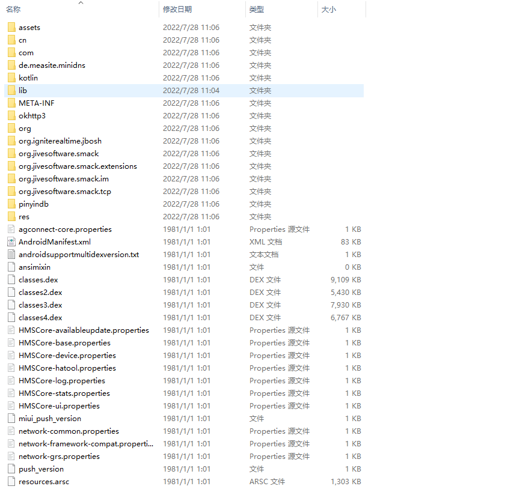

## APK文件结构

在这个文件系统当中

### assets(资产) 文件夹和res都是资源文件夹

res 文件夹 都是用来存放静态资源的，比方说图片资源，json配置文件 ，二进制数据文件等等

他们两个区别就是

assets 是能够存放任意的深度的文件，想放什么就放什么

res 却是和代码有互动，有关联的资源，他里面的布局都是固定的，会在R.java文件下生成标记

### lib

代表就是当前 app 所用的 so 文件（so文件是通过底层 C C++ 代码实现的，其实就是依赖库，相当于Linux的.dll ）

### META-INF

MANIFEST.MF：这是摘要文件（就是查看安装包里面的文件是否被篡改，是否丢失）。程序遍历Apk包中的所有文件，对非文件夹非签名文件的文件，逐个用SHA1生成摘要信息，再用Base64进行编码。如果你改变了apk包中的文件，那么在apk安装校验时，改变后的文件摘要信息与MANIFEST.MF的检验信息不同，于是程序就不能成功安装。

（记录 apk 中每一个文件对应的摘要信息，防止某个文件被篡改。）

### CERT.SF：

这是对摘要的签名文件。对前一步生成的MANIFEST.MF，对MANIFEST.MF中的每一条内容分别进行SHA1计算，然后再用Base64编码转换。此外，把MANIFEST.MF的内容也进行SHA1计算，并且计算BASE64编码。将上述内容写入CERT.SF文件中。

（记录 **MANIFEST.MF** 文件的摘要，以及 **MANIFEST.MF** 中，每个数据块的摘要。防止 **MANIFEST.MF** 被篡改。）

**CERT.RSA** 这个文件是为了验证 CERT.SF 文件有没有被篡改。

中保存了公钥、所采用的加密算法等信息，此外重要的，还包括对CERT.SF中的内容的用私钥进行加密之后的值

### AndroidManifest.xml

他是Android的一个配置文件

### class.dex 文件

可以看到，在我们的电脑当中有很多的 class.dex 的文件

有 class.dex，class1.dex lcass2.dex Android的所有代码都集中在这里，是应用的可执行文件，如果一个 class.dex 的方法数超过了65535个，那么就说明需要分包处理，如果没有超过这个数字，就只有一个class.dex，可以通过dex2jar（反编译工具）转化为 jar 包，再通过jd-gui 查看其代码

### resources.arsc

资源索引表，也就是记录资源和资源对应的 ID 的信息的表格