# IDAso层动态调试破解登录过程实例

***此教程当中所用的 APK 在 release 当中的  JEBDebugger_so.zip 压缩包当中***

### 检查是否可以调试

查看 Manifest.xml 的文件的 debuggerable 如果是 True 那么就是可以进行调试的，如果是 false 就说明不能够进行调试（将他放在 Androidkiller 当中改好了以后，回编译，打包进行调试）

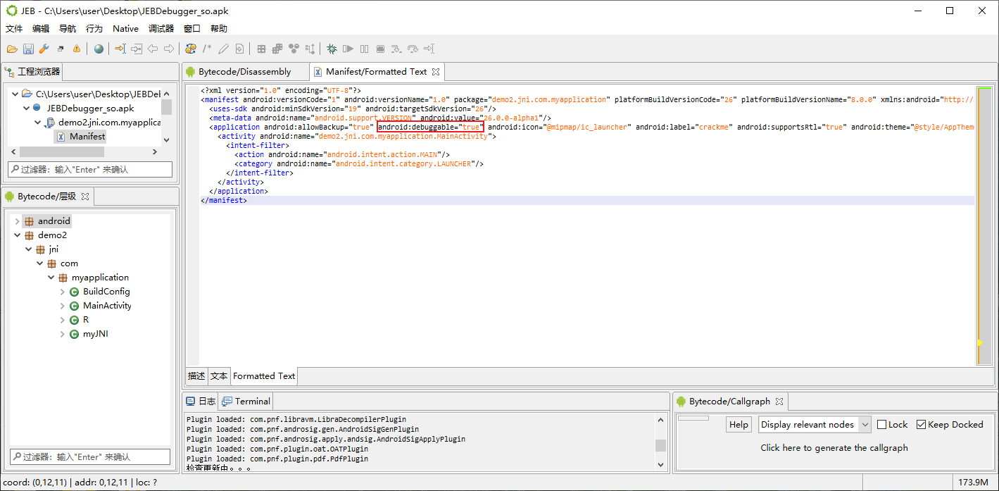

### 静态分析 APK 

找到了整个程序的入口

通过这个程序的入口分析这个程序，找到了验证账号和密码的位置在 chech() 函数这个地方

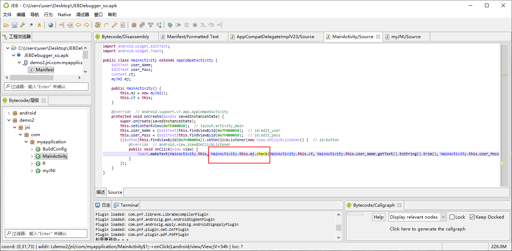

双击进去查看这个函数发现这是一个被 native 修饰的函数，说明函数的实现是通过 C语言实现的，也就是 so 层

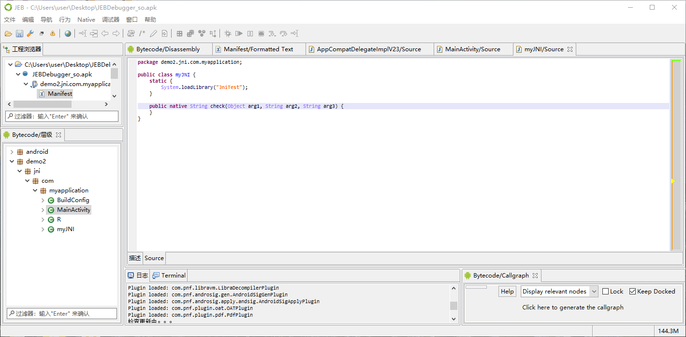

将你的对应的 apk 文件解压，发现这个文件夹下面还 x86 和 armeabi-v7a 的文件夹，说明这个 apk 是 32位 的 apk 对应的，需要打开 32位 的 IDA pro ，并且将 \JEBDebugger_so\lib\armeabi\libJniTest.so 文件放在 IDA pro 当中（因为 JEB 不能够查看 so 层的信息）

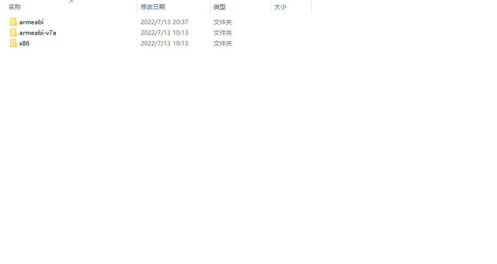

直接选择 **ok** 

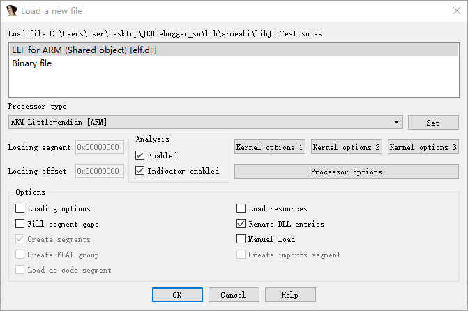

打开 Exports 表格，查找我们需要分析的函数

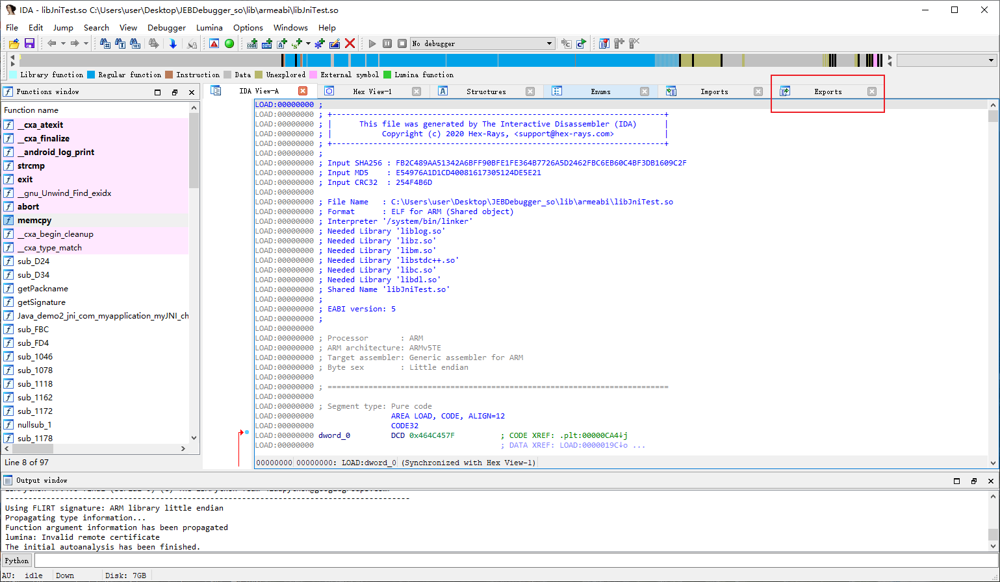

因为我们的函数叫做 check() 函数所以它的名字叫做 Java_demo2_jni_com_myapplication_myJNI_check

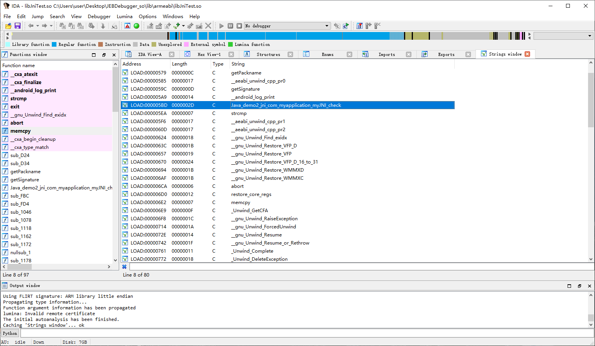

双击刚刚的那个函数，就能够看得到这个界面，在这个界面按下 F5 能够将汇编代码转变成 C 代码

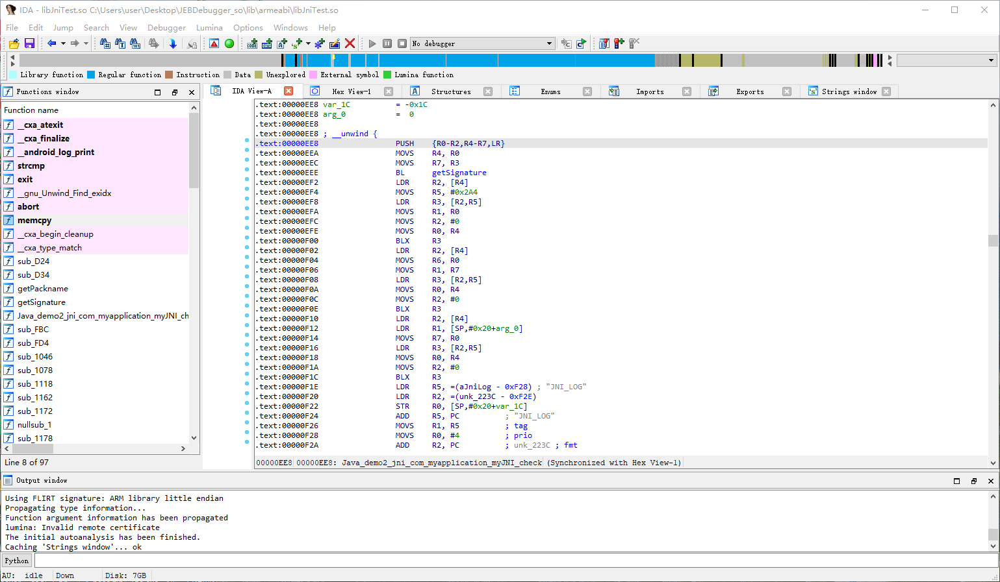

鼠标右键选择 Hide casts 选择隐藏数据类型（目的是为了查看代码方便）

类似这样的就是 IDA pro 没有识别到，需要手动识别

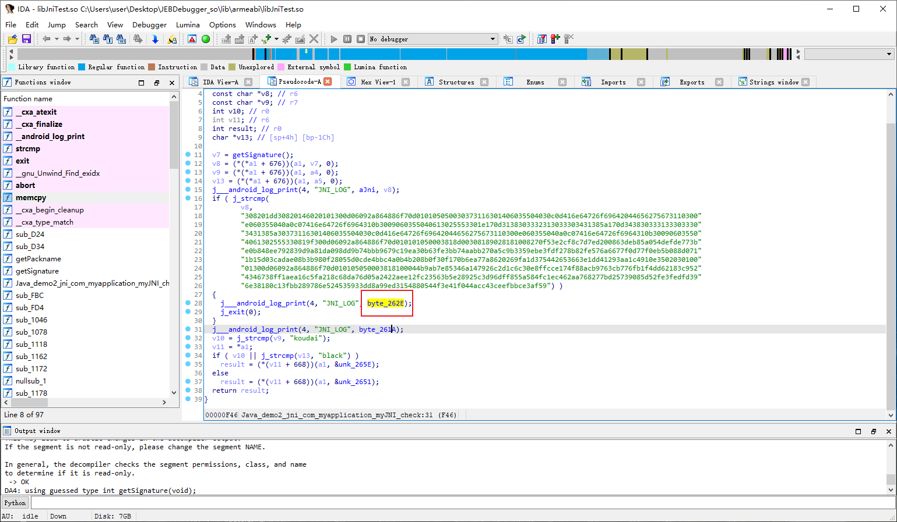

双击进入按下 A（进行手动识别字符串）/P（进行手动识别函数）->  Esc（返回）-> table/F5 （切换到 C 代码） -> F5（刷新）

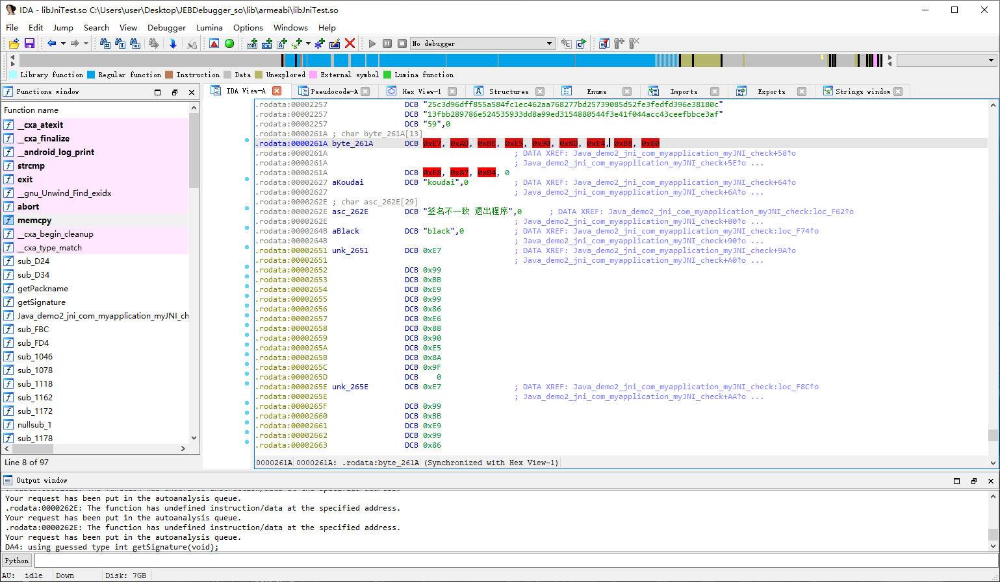

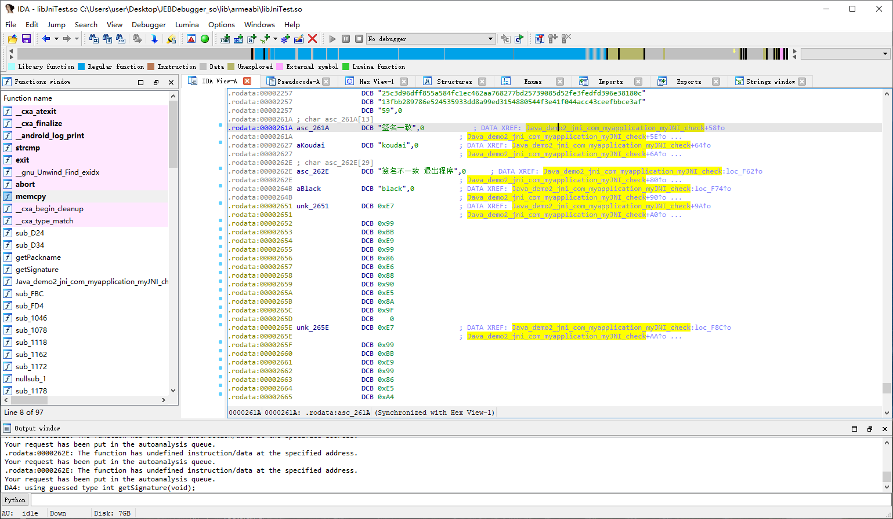

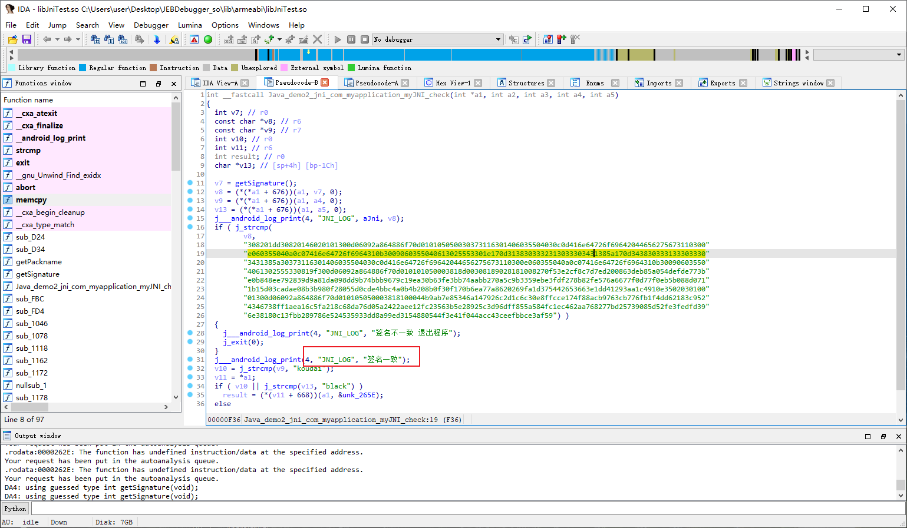

修改 check() 函数的数据类型，我们知道这个函数的前面的两个参数 分别是 JNIEnv *env 和 jobject obj ，按 Y 键进行数据类型的修改

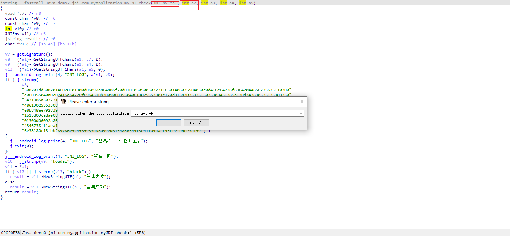

修改 check() 函数的参数，按 N 键，进行参数的重命名

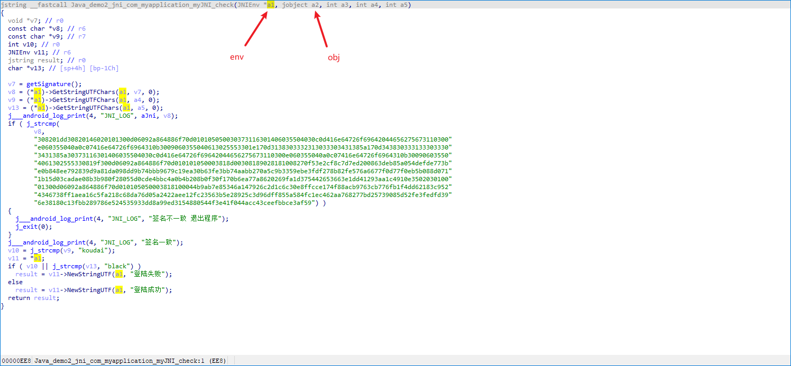

通过 JEB 的静态分析，我们知道 Check() 一共有三个参数

MainActivity.this.ct

MainActivity.this.User_Name.getText().toString().trim()

MainActivity.this.User_Pass.getText().toString().trim()

第一个是什么我们不用管

第二个是用户名

第三个是密码

分别对应了 int a4, int a5，a4 参数在后面转换成了 $V_9$ ，a5 参数在后面转换成了 $V_{13}$

通过分析参数，找到了账号和密码的判断函数

### 进行附加进程调试

* 将 Android_server（如果是64位的软件就需要使用 Android_server64 ） push 到 data/local/tmp 文件夹当中 `adb push android_server /data/local/tmp`
* 给一个 root 的权限 `su` 
* 给他一个 777 的最高权限 `chmod 777 android_server` 
* 

打开你的软件让他出运行的状态

打开 IDA pro （需要打开对应的 IDA pro 在刚刚的分析当中我们已经知道这个 APP 是 32位 的 APP 所以 使用 IDA pro 如果是 64 位的 APP 那么就使用 IDA pro 64）

选择 Debugger -> Attach -> Remote ...

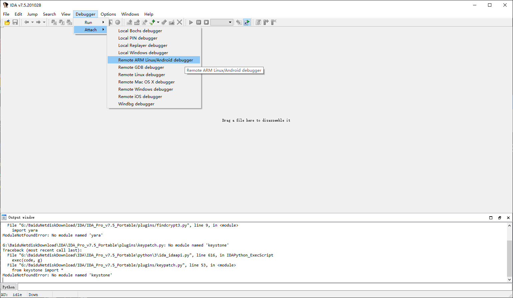

