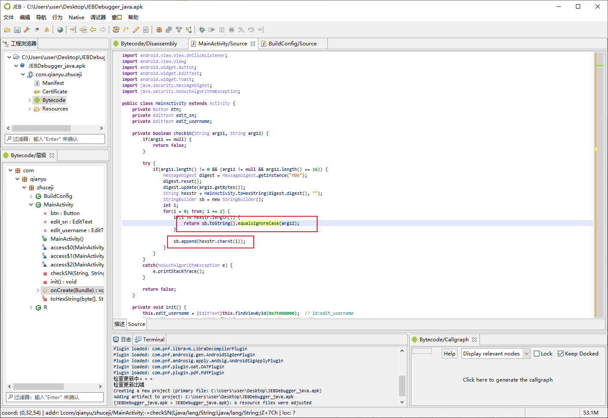
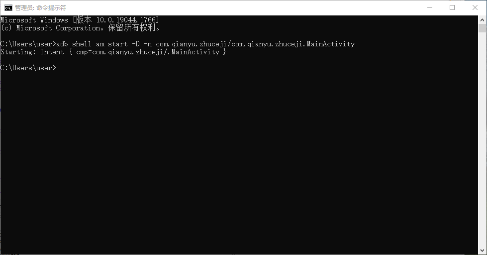
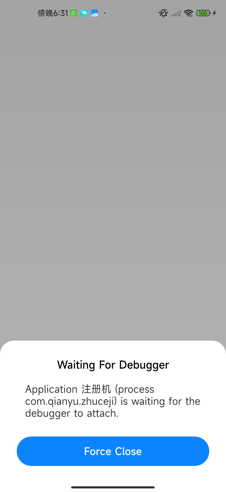
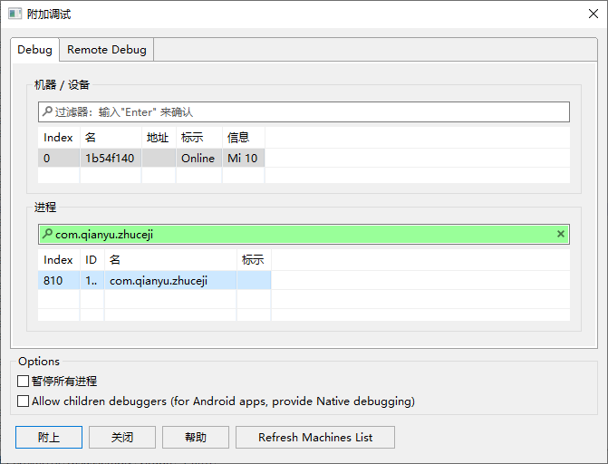
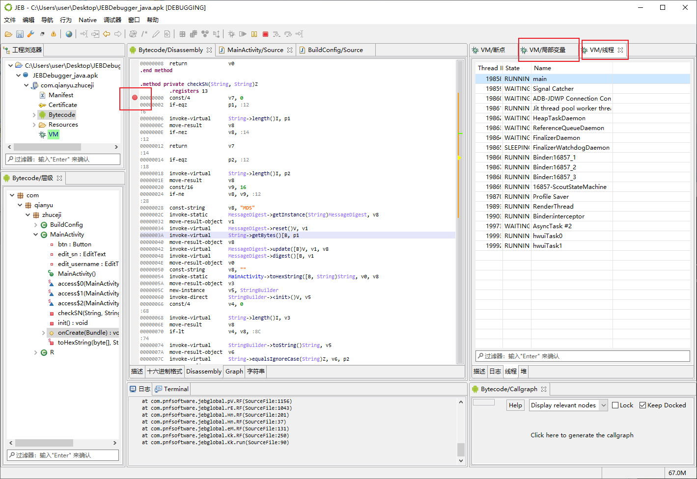
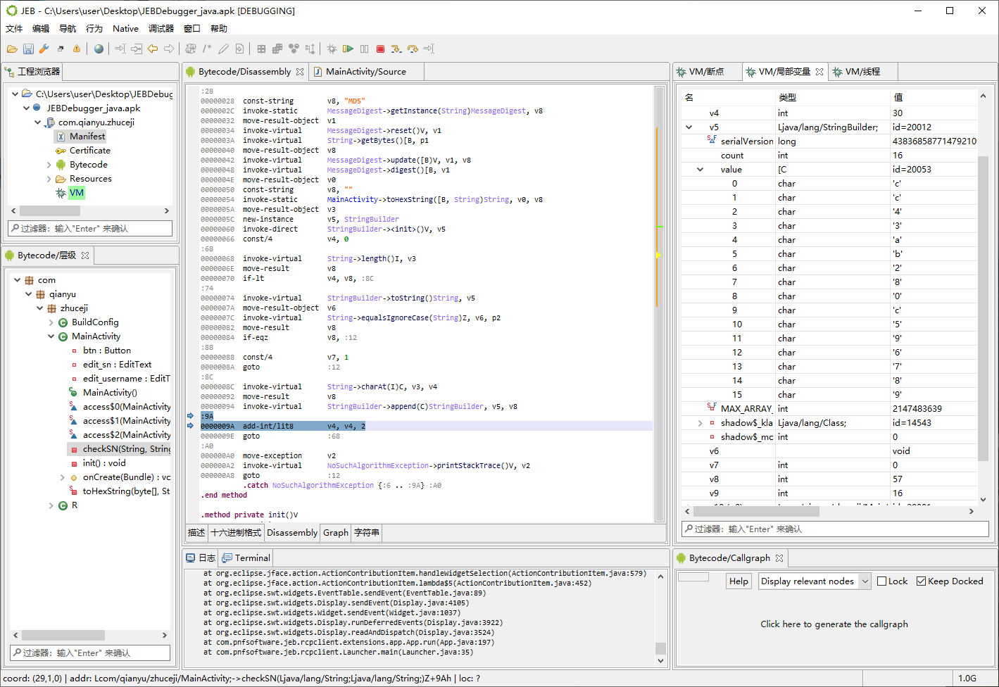

# JEB动态调试获取注册码_java层

- [JEB动态调试获取注册码_java层](#jeb动态调试获取注册码_java层)
  - [检查是否可以调试](#检查是否可以调试)
  - [静态分析代码](#静态分析代码)
  - [动态调试](#动态调试)

***此教程当中所用的 APK 在 release 当中的  JEBDebugger_java.zip 压缩包当中***

## 检查是否可以调试

查看 Manifest.xml 的文件的 debuggerable 如果是 True 那么就是可以进行调试的，如果是 false 就说明不能够进行调试（将他放在 Androidkiller 当中改好了以后，回编译，打包进行调试）

## 静态分析代码

首先将我们的 apk 放进 JEB 当中，左边的显示了这个当中有三个类，随便双击打开一个，通过 tab 键，切换 smali 代码和 Java 代码

通过分析发现，软件打开之后直接呈现注册画面，所以注册内容在整个程序比较靠前的位置，onCreate() 函数是初始化整个程序的部分，所以从这个地方开始分析，在 MainActivity 这个类当中的 onCreate() 函数有一个判断程序是否注册成功的程序，判断的依据就是 checkSN() 这个函数，双击查看这个程序

发现验证码的对比处以及，验证码的存放位置

通过分析 smali 代码能够发现，$V_6$ 寄存器当中存放的就是经过字符串转换之后的 验证码信息，正在和输入进来的 $P_2$  寄存器进行比对，而 $V_6$ 寄存器当中的值来自于 $V_5$  寄存器，所以需要动态调试查看 $V_6$  寄存器的值

## 动态调试

执行

`adb shell am start -D -n com.qianyu.zhuceji/com.qianyu.zhuceji.MainActivity` 

`adb shell am start -D -n 包名\类名`

挂载程序

手机出现这个就算是成功了

选择开始 debugger

选择你的进程

调试的界面最左边的分别是寄存器列表，和线程列表，下面是你想要停下来的断点的位置，因为我们的程序还没有输入账号和验证码，所以程序还没有运行到（Ctrl + B）断点的位置，有时候你进入了这个步骤，还是没有断下来，可能是 JEB 的问题

通过 debugger 在 $V_5$ 寄存器当中发现了验证码（如果你的寄存器的数据类型不正确，是没有把饭看到值的，需要修改数据类型）

验证这个验证码是否能够登录，能够登陆说明，分析成功

